# Architecture

## Purpose

StockMarket is a production-grade investing research system, not a live trading bot. The MVP ranks stock and options opportunities, stores the reasoning behind each idea, supports operator review, and records paper-trading outcomes before any future live trading work is considered.

## Core Principles

- Research first, paper trading second, live trading later only after explicit approval.
- Explainable signals over black-box picks.
- Provider adapters over hardcoded vendor access.
- Source timestamps and citations on every research output.
- Risk, uncertainty, and no-trade outcomes as first-class product behavior.
- Full auditability for pipeline runs, recommendations, operator decisions, and paper trades.

## Target Monorepo Structure

```text
apps/
  web/                 Operator dashboard and review UI
  api/                 Backend API, auth boundary, and pipeline endpoints
packages/
  core/                Domain models, shared contracts, enums, validation
  data/                Provider interfaces, ingestion jobs, normalization
  db/                  Schema, migrations, seed/dev data
  scoring/             Explainable signal scoring and ranking
  backtesting/         Historical simulation and strategy validation
  paper-trading/       Simulated positions, exits, P/L, lessons learned
  agents/              Agent prompts, workflow templates, report contracts
docs/                  Architecture, compliance, operations, roadmap
```

This is the preferred structure for the first implementation. If a future framework scaffold imposes a different convention, preserve the module boundaries even if paths change.

## Research-Informed Architecture Decisions

The external research phase is summarized in `docs/research/recommendation-summary.md`. Current decisions:

- Custom-build MVP domain contracts, provider adapters, scoring, risk controls, paper-trading ledger, audit logs, and the initial backtesting harness.
- Add a strategy registry and evidence-gate layer so strategy families remain testable hypotheses rather than undocumented ranking logic.
- First MVP strategy families should be liquid stock/ETF earnings drift, earnings surprise continuation, momentum, volatility-adjusted mean reversion, news-confirmed watchlist signals, and value/quality context. Options, sector rotation, pairs/stat-arb, ML, and crypto are deferred until their data and risk requirements are met.
- Use external quant projects such as QuantConnect LEAN, Qlib, vectorbt, Zipline Reloaded, Backtrader, and QuantStats as references or later benchmark integrations, not MVP foundations.
- Avoid direct dependencies with AGPL or unclear license obligations until a license review is complete.
- Prefer provider adapters over MCP or direct third-party access for market/news/broker data.
- Keep broker order placement, live trading, crypto exchange trading, and autonomous portfolio management out of the MVP.
- Plan React-compatible UI components around dense operator workflows: financial charts, sortable/filterable tables, risk panels, source citations, status visibility, and audit trails.
- Defer runtime multi-agent orchestration frameworks until deterministic data, scoring, risk, and audit workflows are stable.

## System Flow

```mermaid
flowchart LR
  Providers["Market, news, earnings, options, fundamentals providers"] --> Ingestion["Ingestion adapters"]
  Ingestion --> Quality["Data quality and freshness checks"]
  Quality --> DB["Application database"]
  DB --> Strategies["Strategy registry and evidence gates"]
  Strategies --> Scoring["Explainable scoring engine"]
  Scoring --> Risk["Risk manager and no-trade filters"]
  Risk --> Recs["Recommendations and daily report"]
  Recs --> UI["Operator dashboard"]
  UI --> Decisions["Watch, paper trade, reject, needs review"]
  Decisions --> Paper["Paper-trading ledger"]
  Paper --> Validation["Backtesting and paper-trade validation"]
  Validation --> Scoring
```



## Main Components

### Data Ingestion

The ingestion layer normalizes provider data into stable internal models. Each provider category must have an interface and one or more adapters:

- Market data provider.
- Options data provider.
- News provider.
- Fundamentals provider.
- Earnings provider.
- Sentiment provider.
- Broker provider for future paper/live integration only.

Provider responses must be stored with source, retrieval timestamp, provider timestamp when available, raw reference ID, and data quality status.

Initial provider evaluation should prioritize Polygon.io for market/options data, Financial Modeling Prep or Finnhub for fundamentals/news/earnings, SEC EDGAR for official filings, and FRED for macro context. Tradier and Alpaca remain future candidates for broker paper integration only after internal paper trading is stable.

### Database

Use migrations from day one. The schema should cover:

- Tickers and instruments.
- Price history.
- Options chains and option snapshots.
- Earnings events and surprises.
- News articles and article-source metadata.
- Sentiment results.
- Fundamental metrics.
- Daily scores and signal components.
- Strategy definitions, strategy versions, and evidence gates.
- Recommendations.
- Paper trades.
- Backtest runs and strategy definitions.
- Watchlists.
- Audit logs and data quality logs.
- User/operator settings.

### Scoring Engine

The scoring engine produces component scores and explanations, not just a final rank. Initial components:

- News sentiment.
- Earnings catalyst strength.
- Historical earnings reaction.
- Momentum.
- Mean reversion.
- Valuation.
- Options undervaluation.
- Liquidity.
- Risk.
- Confidence.
- Timing.
- Sector and macro alignment.

Each score must expose inputs, timestamps, assumptions, and reasons. Missing or stale data should lower confidence or produce `needs more data`.

### Strategy Registry And Evidence Gates

The strategy registry defines which hypothesis generated or influenced a recommendation. It should store strategy family, strategy version, eligible instruments, required data, entry/exit rule references, allowed decision outputs, validation status, and promotion state.

Initial families:

- Earnings.
- Momentum.
- Mean reversion.
- Volatility.
- Options.
- News / sentiment.
- Value / quality.
- Sector / macro.
- Portfolio risk.

MVP promotion state should be conservative: `research only`, `watchlist eligible`, `paper trade eligible`, `avoid`, or `needs more data`. A strategy cannot become `paper trade eligible` without reproducible backtest or paper-trade evidence. Options strategies cannot become `paper trade eligible` from underlying-only proxy analysis.

Milestone 4 implements the first code-level strategy policy catalog in `packages/scoring`. The API exposes it at `/strategies/policies`, and the operator console shows the active policy for the mock scoring result. This is still deterministic policy metadata: it does not call providers, require `.env`, place trades, or claim that a strategy is profitable.

### Options Analysis

Options analysis must evaluate expiration, strike logic, bid/ask spread, volume, open interest, implied volatility, realized volatility, expected move, breakeven, event risk, theta risk, max loss, and whether a spread is safer than a long call or put. Illiquid, wide-spread, event-exposed, or overpriced contracts should default to avoid.

Allowed MVP options research structures are long calls, long puts, and debit spreads only after historical chain data supports realistic fill and liquidity analysis. Naked short options, undefined-risk spreads, short volatility, 0DTE, margin-dependent strategies, and broker order placement remain prohibited.

### Research API

The API should expose typed endpoints for:

- Daily opportunities.
- Ticker detail.
- Options summary.
- News and sources.
- Earnings calendar.
- Recommendation detail and audit trail.
- Paper-trading actions.
- Backtest results.
- Strategy evidence and validation status.
- Data freshness and system health.

No API route should place real-money trades in the MVP.

### Operator UI

The UI is an operator console, not a marketing site. It should be dense, scan-friendly, and built around decisions:

- Daily top opportunities.
- Watchlist.
- Ticker detail.
- Options chain summary.
- Risk panel.
- Backtest and paper-trade evidence.
- Strategy family, validation status, and promotion state.
- Source citations and timestamps.
- Data freshness status.
- Audit log.
- Decision buttons: watch, paper trade, reject, needs review.

### Paper Trading

The paper-trading package starts as a pure simulated ledger contract. It accepts only core `paper_trade` eligible recommendations, operator approval metadata, explicit entry/exit rules, and conservative paper-exposure limits. It returns a simulated paper position with audit fields and no broker execution surface.

Milestone 6 begins with stock-only paper positions. Options paper trading remains blocked until a future options policy review promotes the strategy family and historical options chain validation is available.

Paper-trade persistence is now represented by a dedicated `paper_trades` migration and DB ledger helper. The durable record is stock-only for MVP, stores operator approval and entry audit references, requires numeric stop-loss, profit-target, and time-stop fields, enforces conservative paper exposure caps, and hard-codes `mode = paper`, `live_trading_enabled = 0`, and `broker_execution = 0`.

The paper-trading package also defines a simulated close contract. Closing a paper trade requires timestamped exit price evidence, an exit reason, lessons learned, and an audit ID; it computes realized P/L and return percent while rejecting duplicate closes and broker-shaped fields.

DB close persistence is handled by `0003_paper_trade_closes.sql` and the paper-trade ledger helper. A persisted close updates only open paper trades, requires a close audit log reference, stores exit price, exit reason, lessons learned, and closed timestamp, and rejects duplicate close attempts.

The API exposes `/paper-trading/mock-decision` as a non-durable contract demonstration. It does not persist records, require provider keys, or execute broker actions.

The API also exposes `/paper-trading/mock-ledger-dry-run` as an in-memory persistence check. It seeds the minimum strategy, recommendation, and audit records, persists one accepted mock stock paper trade through the DB ledger helper, returns safe counts, and discards the database after the response.

The operator console can display the mock paper-trading contract state beside scoring gates so the operator sees paper-only status, max loss, and risk percent without turning the mock result into a recommendation.

### Project Status And Roadmap Visibility

Until the application has a database-backed admin UI, lightweight project status lives under `docs/status/`. The future operator UI should include a Project Status / Roadmap dashboard that can surface:

- Current focus.
- Roadmap items.
- Research progress.
- Open questions.
- Decision log.
- Validation and test status.
- Agent activity and handoffs.

This dashboard is operational visibility for the project itself, not an investing recommendation feature. It should remain simple and read-only until the core research, paper-trading, and audit workflows are stable.

### Auditability

Every pipeline run, score, recommendation, operator action, and paper trade must write an audit record. Audit records should include input versions, provider timestamps, model/prompt versions when AI is used, scoring versions, and operator identity when authentication exists.

## AI Use

AI may summarize news, extract catalysts, compare bull/bear cases, and help draft research narratives. AI output must be grounded in stored source data. AI must not invent prices, options metrics, earnings dates, or citations. Quantitative calculations must come from deterministic code.

External articles, filings, provider data, and web/news content must be treated as untrusted input. The AI layer must separate instructions from retrieved content and must not let retrieved text alter system rules, risk controls, or execution permissions.

## Codex Lifecycle Hooks

Repository-local hooks in `.codex/hooks.json` provide development-time guardrails. They are deterministic local scripts that check prompts, tool use, permission requests, subagent starts/stops, and end-of-turn validation. They help enforce safety, validation, and memory hygiene while the application itself remains responsible for runtime controls.

## Future Live Trading Boundary

Future live trading requires a new architecture review, compliance review, broker paper-trading integration, kill switch, max daily loss, max position size, approval queue, complete audit logs, and explicit operator approval. The MVP must make real-money execution impossible.
